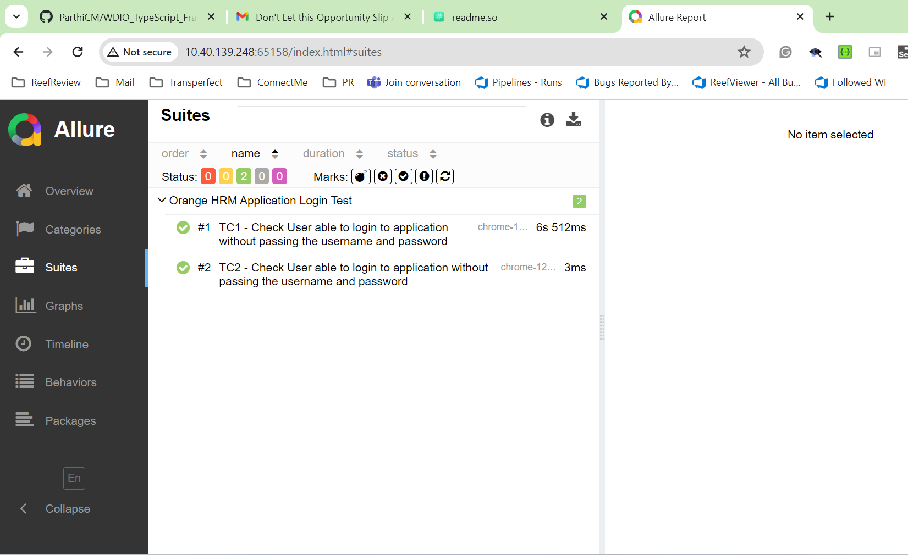

# Webdriver IO CLI Test FrameWork 


This is the Initial frame work for automating the web application
 
## Installation

Install my-project with npm

```bash
    'npm i' to install all the required packages
```
    
## Test Execution

Execute Test with npm scripts

```bash
    'npm loginTest' to trigger the login suite
```

```bash
    'npm E2ETest' to trigger the E2E Test
```

## Report Generation

Generate Report with npm scripts

```bash
    'npm Open-Allure-Report' to Open the Allure Report 
```

## Sample Report

